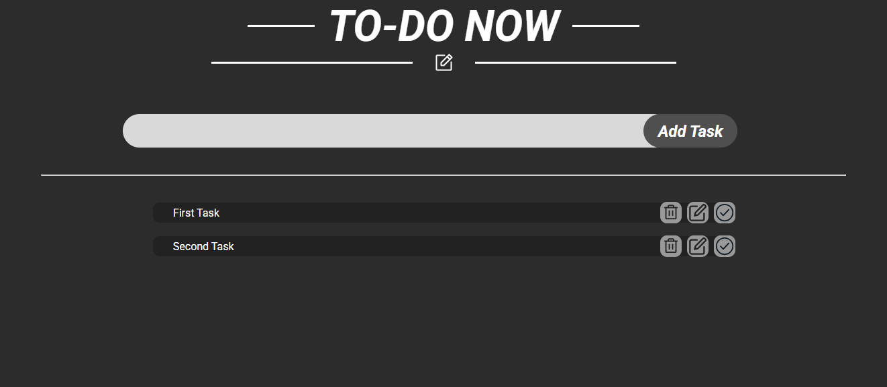

# To-Do List Project



## Description

This is a simple To-Do List project built with JavaScript, HTML, and CSS. It allows users to add, delete, update, and mark tasks as "done." The tasks are stored in `localStorage` so they persist across page reloads.

## Features

- Add new tasks
- Delete tasks
- Update tasks
- Mark tasks as "done"
- Persist tasks using `localStorage`

## Getting Started

### Prerequisites

To run this project locally, you will need:

- A web browser (Chrome, Firefox, etc.)
- A code editor (VSCode, Sublime, etc.)

### Installation

1. Clone the repository:
    ```bash
    git clone https://github.com/Ayman-Elfeky/To-Do-List-2.git
    ```

2. Open the `index.html` file in your browser.

## Usage

- **Add Task:** Enter a task description and click "Add" to add it to your list.
- **Update Task:** Edit the task description and click "Update."
- **Delete Task:** Click the "Delete" button next to the task to remove it.
- **Mark as Done:** Click the "Done" button to mark a task as completed.

## Code Structure

- **index.html:** Contains the basic structure of the page.
- **styles.css:** Contains the styling for the To-Do List.
- **script.js:** Contains the JavaScript logic for managing tasks and interacting with `localStorage`.

## Contributing

Feel free to fork the repository and submit pull requests with improvements or bug fixes!
